<div align="center">


# DevBoard Pro

### Full-Stack SaaS Project Management Platform for Developer Teams

[](https://reactjs.org/)
[](https://nodejs.org/)
[](https://mongodb.com/)
[](https://socket.io/)
[](https://tailwindcss.com/)

[Live Demo](#) • [Features](#-features) • [Tech Stack](#-tech-stack) • [Setup](#-getting-started) • [API Docs](#-api-endpoints)

### 🎬 Demo

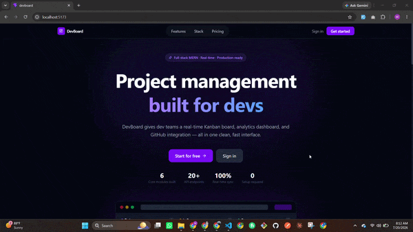

</div>

---

## 📌 Overview

**DevBoard Pro** is a production-ready, full-stack SaaS project management tool built specifically for developer teams. It combines real-time Kanban boards, role-based access control, analytics dashboards, and GitHub webhook integration — all in a clean, fast interface inspired by Linear and Jira.

Built as a portfolio project to demonstrate full-stack engineering skills across the entire MERN stack, including WebSocket architecture, JWT security patterns, MongoDB aggregations, and cloud integrations.

---

## 🖼️ Screenshots

<table>
  <tr>
    <td align="center" width="50%">
      <b>Landing Page</b><br/><br/>
      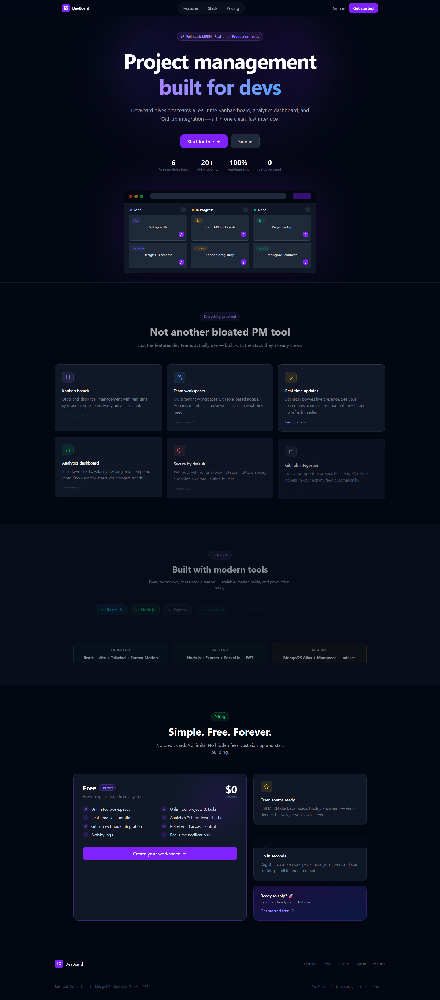
    </td>
    <td align="center" width="50%">
      <b>Login</b><br/><br/>
      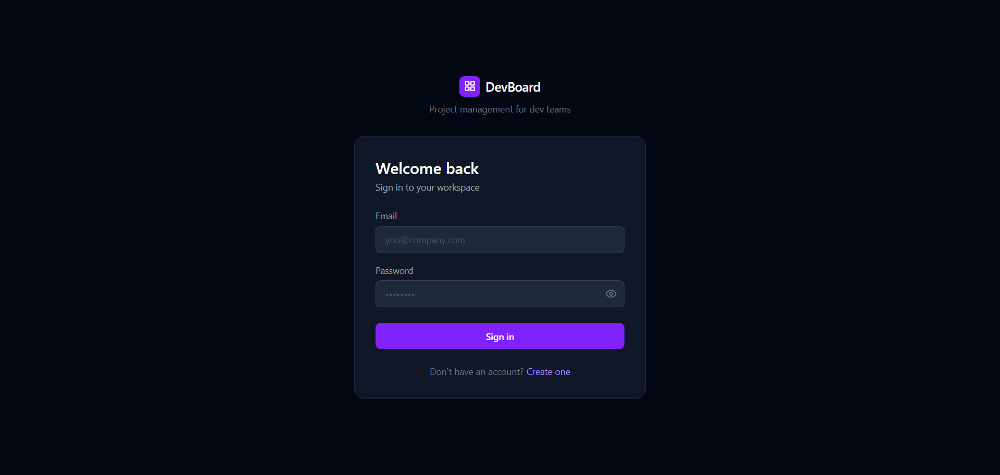
    </td>
  </tr>
  <tr>
    <td align="center" width="50%">
      <b>Dashboard</b><br/><br/>
      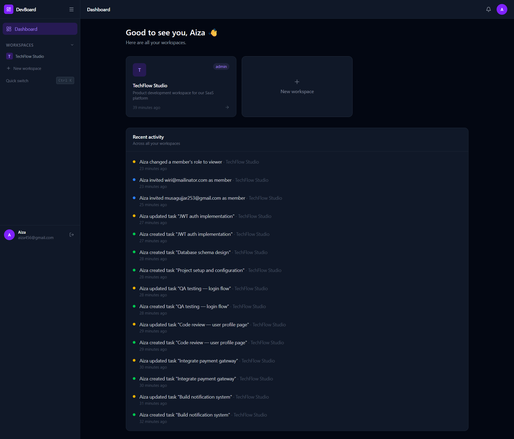
    </td>
    <td align="center" width="50%">
      <b>Projects</b><br/><br/>
      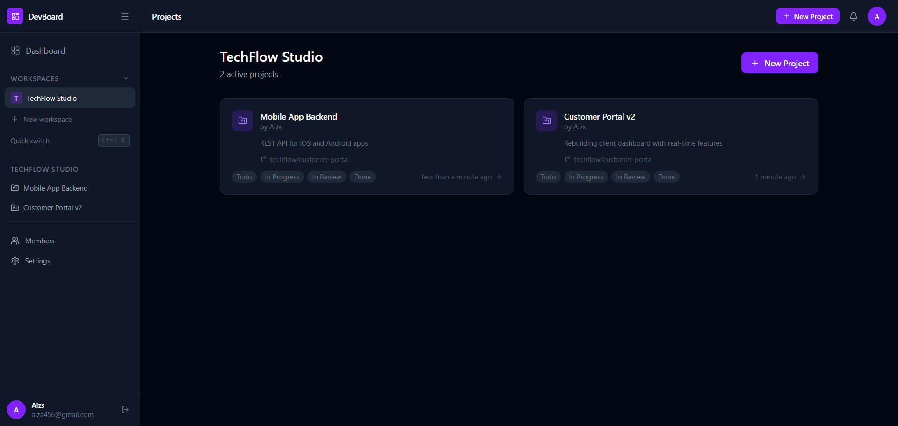
    </td>
  </tr>
  <tr>
    <td align="center" width="50%">
      <b>Kanban Board</b><br/><br/>
      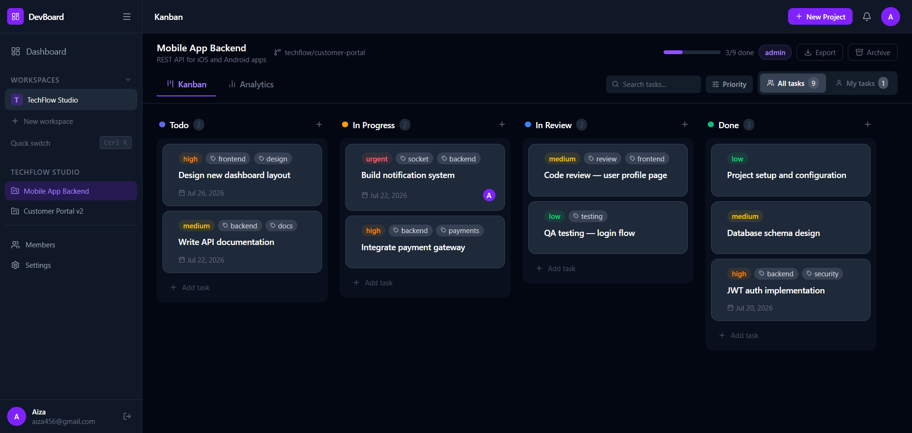
    </td>
    <td align="center" width="50%">
      <b>Task Modal</b><br/><br/>
      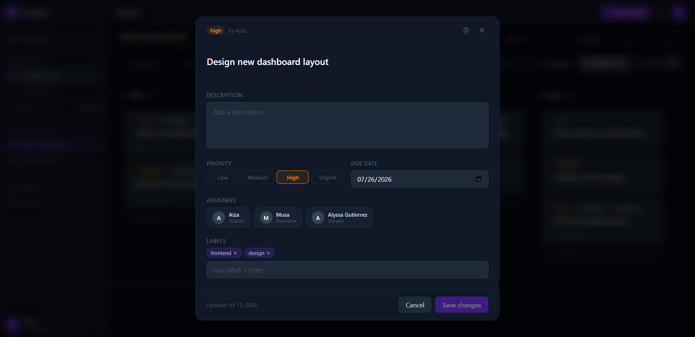
    </td>
  </tr>
  <tr>
    <td align="center" width="50%">
      <b>Analytics</b><br/><br/>
      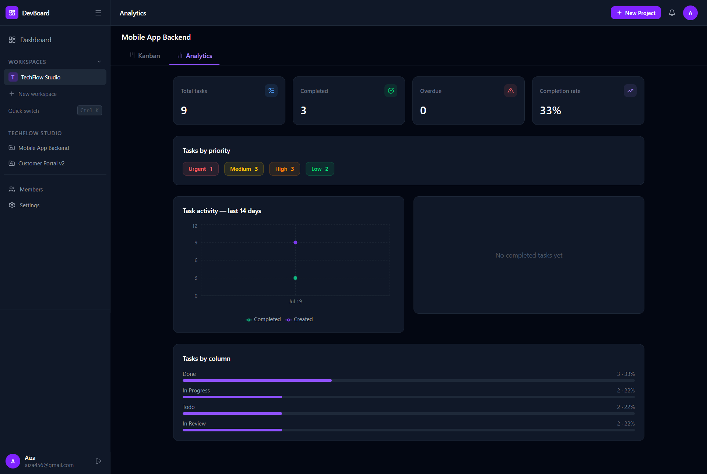
    </td>
    <td align="center" width="50%">
      <b>Members</b><br/><br/>
      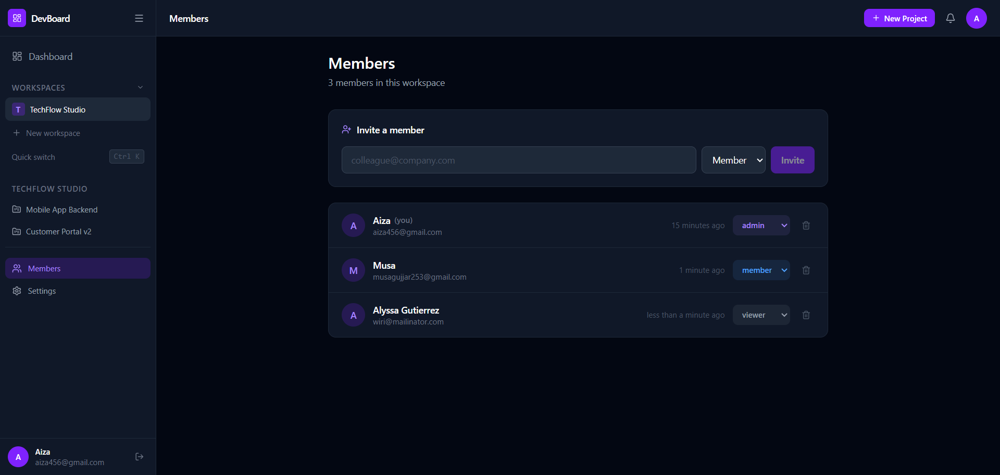
    </td>
  </tr>
  <tr>
    <td align="center" width="50%">
      <b>Settings</b><br/><br/>
      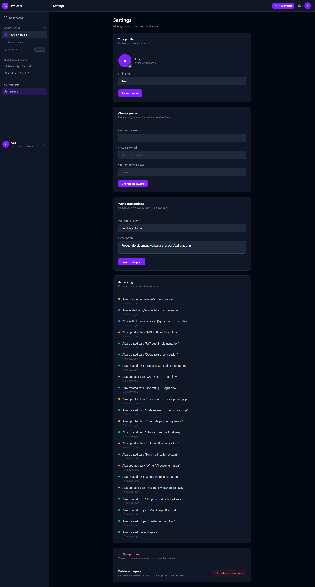
    </td>
    <td align="center" width="50%">
      <b>Admin Dashboard</b><br/><br/>
      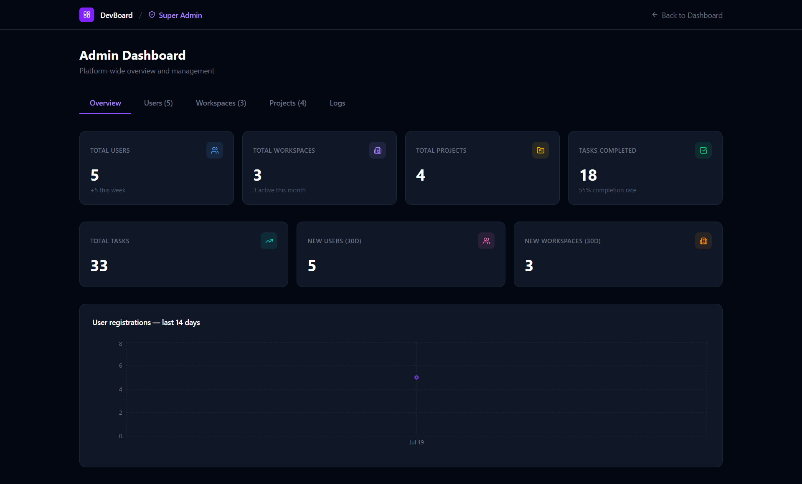
    </td>
  </tr>
</table>

---

## ✨ Features

### 🔐 Authentication & Security
- JWT access tokens (15 min expiry) + refresh token rotation (7 days)
- Refresh token reuse attack detection — automatically invalidates all sessions
- Bcrypt password hashing with salt rounds
- HTTP-only cookies for refresh token storage
- Rate limiting on all API endpoints (300 req/15min general, 10 req/15min auth)
- Helmet.js security headers

### 🏢 Multi-Tenant Workspaces
- Create unlimited workspaces per user
- Invite members by email with Nodemailer
- Role-based access control — **Admin**, **Member**, **Viewer**
- Join workspace via invite link or invite code
- Transfer workspace ownership automatically on user deletion

### 📋 Projects & Kanban
- Create projects inside workspaces with optional GitHub repo linking
- 4 default columns — Todo, In Progress, In Review, Done
- Drag-and-drop task management powered by **@dnd-kit**
- Cross-column move and same-column reorder with **bulkWrite** (single DB round trip)
- Archive and restore projects
- Task progress bar with completion percentage

### ✅ Tasks
- Full task CRUD with title, description, priority, due date, labels, assignees
- Priority levels — Low, Medium, High, Urgent with color coding
- Auto-sets `completedAt` timestamp when task moves to Done column
- Overdue task detection with visual alert banner
- My Tasks / All Tasks filter toggle
- Task search by title, description, or label
- Priority filter dropdown
- Export all tasks to CSV

### ⚡ Real-Time Collaboration
- Socket.io WebSocket connection with JWT authentication
- Live Kanban board updates — create, move, update, delete tasks sync instantly across all connected users
- Online presence indicator — see who else is viewing the same board
- Real-time notifications delivered via socket to recipient's personal room

### 🔔 Notifications
- Bell icon with unread count badge
- Real-time notification delivery via Socket.io
- Notifications for: task assigned, task moved to done, workspace invite
- Mark single or all as read
- Delete individual notifications or clear all read
- 60-second polling fallback if socket disconnects

### 📊 Analytics Dashboard
- Task burndown chart — created vs completed per day (last 14 days)
- Member velocity chart — completed tasks per assignee
- Tasks by priority breakdown
- Tasks by column distribution with animated progress bars
- Completion rate, overdue count, total tasks summary cards

### 🔗 GitHub Webhook Integration
- Link any GitHub repo to a project
- Receives push and pull_request events via webhook
- HMAC SHA-256 signature verification with `timingSafeEqual` (prevents timing attacks)
- Events stored in ActivityLog and emitted via Socket.io to project viewers

### 📁 File Uploads
- Profile avatar upload to Cloudinary (devboard/avatars/ folder)
- File size limit: 2MB, allowed types: JPEG, PNG, WebP
- Old avatar deleted from Cloudinary before uploading new one

### 🛡️ Super Admin Panel
- Separate `/admin` route — accessible only to users with `isSuperAdmin: true`
- Platform overview — total users, workspaces, projects, tasks, completion rate
- User registrations chart (last 14 days) with Recharts AreaChart
- Tasks by priority pie chart
- All users table with search, pagination, user details modal, delete user
- All workspaces table with owner, member count, project count
- All projects table with workspace, status, task count
- Delete user with full cascade — transfers workspace ownership or promotes next member

### 🎨 UI/UX
- Dark / Light mode toggle with persistence via Zustand + localStorage
- Framer Motion animations throughout
- Skeleton loading states on all data-heavy pages
- Professional HTML email templates with DevBoard branding
- Drag handle with 8px activation threshold (prevents accidental drags)
- DragOverlay with rotation effect
- Viewer restriction banner — read-only experience for Viewer role
- Responsive design

---

## 🛠 Tech Stack

### Frontend
| Technology | Purpose |
|---|---|
| React 18 + Vite | UI framework and build tool |
| Tailwind CSS | Utility-first styling |
| Framer Motion | Animations and transitions |
| @dnd-kit/core | Drag and drop |
| React Query v5 | Server state, caching, optimistic updates |
| Zustand | Client state (auth, UI) |
| React Hook Form + Zod | Form handling and validation |
| Recharts | Analytics charts |
| Socket.io Client | Real-time WebSocket connection |
| React Router v6 | Client-side routing |
| Axios | HTTP client with interceptors |

### Backend
| Technology | Purpose |
|---|---|
| Node.js + Express | REST API server |
| MongoDB + Mongoose | Database and ODM |
| Socket.io | WebSocket server |
| JWT | Access and refresh token auth |
| Bcryptjs | Password hashing |
| Nodemailer | Transactional email |
| Multer | File upload middleware |
| Cloudinary | Cloud image storage |
| Helmet | Security headers |
| Express Rate Limit | API rate limiting |
| Morgan | HTTP request logging |

---

## 📁 Project Structure

devboard/
├── docs/ # README media
│ ├── logo.svg # project logo
│ ├── demo.gif # demo video converted to GIF
│ └── screenshots/
│ ├── 01-landing.png
│ ├── 02-login.png
│ ├── 03-dashboard.png
│ ├── 04-projects.png
│ ├── 05-kanban.png
│ ├── 06-task-modal.png
│ ├── 07-analytics.png
│ ├── 08-members.png
│ ├── 09-settings.png
│ └── 10-admin.png
│
├── client/ # React frontend
│ └── src/
│ ├── api/ # Axios API functions
│ ├── components/
│ │ ├── admin/ # AdminLayout, AdminTable, AdminStatCard
│ │ ├── analytics/ # BurndownChart, VelocityChart, StatsCards
│ │ ├── kanban/ # KanbanBoard, KanbanColumn, TaskCard, TaskModal
│ │ ├── layout/ # Sidebar, Topbar, DashboardLayout
│ │ ├── notifications/ # NotificationPanel, NotificationItem
│ │ └── ui/ # Button, Input, Modal, Badge, Avatar, etc.
│ ├── hooks/ # useAuth, useWorkspace, useTask, useSocket, etc.
│ ├── pages/
│ │ ├── admin/ # AdminOverviewPage, AdminUsersPage, etc.
│ │ └── modals/ # CreateWorkspaceModal, CreateProjectModal
│ ├── store/ # Zustand stores (authStore, uiStore)
│ └── utils/ # queryKeys, cn, formatDate, constants
│
└── server/ # Node.js backend
└── src/
├── config/ # Cloudinary, Nodemailer config
├── controllers/ # Auth, Workspace, Project, Task, etc.
├── middleware/ # JWT auth, role check, multer, rate limiter
├── models/ # User, Workspace, Project, Task, Member, etc.
├── routes/ # All Express routes
├── scripts/ # createSuperAdmin seed script
├── utils/ # ApiError, ApiResponse, asyncHandler, etc.
└── validators/ # express-validator schemas


---

## 🔑 Role Permissions

| Action | Admin | Member | Viewer |
|---|:---:|:---:|:---:|
| Create workspace | ✅ | ❌ | ❌ |
| Invite members | ✅ | ❌ | ❌ |
| Change member roles | ✅ | ❌ | ❌ |
| Create projects | ✅ | ✅ | ❌ |
| Archive projects | ✅ | ❌ | ❌ |
| Create tasks | ✅ | ✅ | ❌ |
| Move / edit tasks | ✅ | ✅ | ❌ |
| Delete tasks | ✅ | ❌ | ❌ |
| Be assigned to tasks | ✅ | ✅ | ✅ |
| View Kanban board | ✅ | ✅ | ✅ |
| View analytics | ✅ | ✅ | ✅ |
| Delete workspace | ✅ | ❌ | ❌ |

---

## 🚀 Getting Started

### Prerequisites
- Node.js v18+
- MongoDB Atlas account (free tier works)
- Cloudinary account (free tier works)
- Gmail account with App Password enabled

### 1. Clone the repository
```bash
git clone https://github.com/yourusername/devboard-pro.git
cd devboard-pro
```

### 2. Setup the server
```bash
cd server
npm install
```

Create `server/.env`:
```env
PORT=5000
NODE_ENV=development
MONGO_URI=mongodb+srv://your_connection_string
CLIENT_URL=http://localhost:5173

ACCESS_TOKEN_SECRET=your_random_secret_here
REFRESH_TOKEN_SECRET=your_random_secret_here
ACCESS_TOKEN_EXPIRY=15m
REFRESH_TOKEN_EXPIRY=7d

EMAIL_HOST=smtp.gmail.com
EMAIL_PORT=587
EMAIL_USER=your@gmail.com
EMAIL_PASS=your_gmail_app_password

CLOUDINARY_CLOUD_NAME=your_cloud_name
CLOUDINARY_API_KEY=your_api_key
CLOUDINARY_API_SECRET=your_api_secret

GITHUB_WEBHOOK_SECRET=any_random_string

SUPER_ADMIN_NAME=Your Name
SUPER_ADMIN_EMAIL=admin@yourdomain.com
SUPER_ADMIN_PASSWORD=your_secure_password
```

### 3. Create Super Admin account
```bash
npm run create-admin
```

### 4. Start the server
```bash
npm run dev
```

### 5. Setup the client
```bash
cd ../client
npm install
```

Create `client/.env`:
```env
VITE_API_URL=http://localhost:5000/api/v1
VITE_SOCKET_URL=http://localhost:5000
```

### 6. Start the client
```bash
npm run dev
```

### 7. Open the app

http://localhost:5173


Login with your super admin credentials → you will be redirected to `/admin`.

For regular users → register at `/register`.

---

## 📡 API Endpoints

### Auth

POST /api/v1/auth/register
POST /api/v1/auth/login
POST /api/v1/auth/logout
POST /api/v1/auth/refresh-token
GET /api/v1/auth/me
PATCH /api/v1/auth/profile
PATCH /api/v1/auth/change-password


### Workspaces

POST /api/v1/workspaces
GET /api/v1/workspaces
GET /api/v1/workspaces/:id
PATCH /api/v1/workspaces/:id
DELETE /api/v1/workspaces/:id
POST /api/v1/workspaces/join/:code
POST /api/v1/workspaces/:id/invite
GET /api/v1/workspaces/:id/activity


### Members

GET /api/v1/workspaces/:workspaceId/members
PATCH /api/v1/workspaces/:workspaceId/members/:userId
DELETE /api/v1/workspaces/:workspaceId/members/:userId


### Projects

POST /api/v1/workspaces/:workspaceId/projects
GET /api/v1/workspaces/:workspaceId/projects
GET /api/v1/workspaces/:workspaceId/projects/archived
GET /api/v1/workspaces/:workspaceId/projects/:id
PATCH /api/v1/workspaces/:workspaceId/projects/:id
DELETE /api/v1/workspaces/:workspaceId/projects/:id


### Tasks

POST /api/v1/workspaces/:workspaceId/projects/:projectId/tasks
GET /api/v1/workspaces/:workspaceId/projects/:projectId/tasks
PATCH /api/v1/workspaces/:workspaceId/projects/:projectId/tasks/:id
PATCH /api/v1/workspaces/:workspaceId/projects/:projectId/tasks/:id/move
PATCH /api/v1/workspaces/:workspaceId/projects/:projectId/tasks/reorder
DELETE /api/v1/workspaces/:workspaceId/projects/:projectId/tasks/:id


### Notifications

GET /api/v1/notifications
GET /api/v1/notifications/unread-count
PATCH /api/v1/notifications/read-all
PATCH /api/v1/notifications/:id/read
DELETE /api/v1/notifications/:id
DELETE /api/v1/notifications/clear-read


### Analytics

GET /api/v1/workspaces/:workspaceId/projects/:projectId/analytics
GET /api/v1/workspaces/:workspaceId/analytics
GET /api/v1/workspaces/:workspaceId/projects/:projectId/tasks/export


### Admin (Super Admin only)

GET /api/v1/admin/stats
GET /api/v1/admin/users
GET /api/v1/admin/workspaces
GET /api/v1/admin/projects
DELETE /api/v1/admin/users/:id


### Webhooks

POST /api/v1/webhooks/github


---

## 🔌 Socket Events

### Client → Server
| Event | Payload | Description |
|---|---|---|
| `join:project` | `projectId` | Join project room |
| `leave:project` | `projectId` | Leave project room |
| `presence:join` | `{ projectId, user }` | Announce viewing |
| `presence:leave` | `{ projectId, userId }` | Announce leaving |

### Server → Client
| Event | Payload | Description |
|---|---|---|
| `task:created` | `{ task }` | New task added |
| `task:updated` | `{ task }` | Task edited |
| `task:moved` | `{ taskId, fromColumn, toColumn, order }` | Task moved |
| `task:reordered` | `{ tasks }` | Tasks reordered in column |
| `task:deleted` | `{ taskId }` | Task deleted |
| `notification:new` | `{ notification }` | New notification |
| `presence:update` | `{ viewers }` | Online users updated |
| `github:event` | `{ event, meta }` | GitHub webhook event |

---

## 🌐 Deployment

### Frontend → Vercel
```bash
cd client
npm run build
# Deploy dist/ folder to Vercel
# Set environment variables in Vercel dashboard
```

### Backend → Render
```bash
# Connect GitHub repo to Render
# Set all .env variables in Render dashboard
# Build command: npm install
# Start command: npm start
```

### Environment variables for production
```env
NODE_ENV=production
CLIENT_URL=https://your-vercel-app.vercel.app
MONGO_URI=your_atlas_connection_string
# ... all other variables same as development
```

---

## 🧠 Key Technical Decisions

**Why React Query over Redux?**
Server state and client state have different requirements. React Query handles caching, background refetching, and optimistic updates out of the box. Zustand handles the small amount of true client state (auth, UI preferences).

**Why optimistic updates with rollback?**
Drag-and-drop feels instant because the UI updates before the API call completes. If the server fails, `onError` receives the previous state from `onMutate` context and reverts — same pattern used by Linear and Jira.

**Why bulkWrite for task reorder?**
Reordering N tasks with N individual `findByIdAndUpdate` calls = N database round trips. `bulkWrite` sends all updates in a single operation — scales to 100+ tasks with no performance degradation.

**Why HMAC for webhooks?**
Anyone knowing the webhook URL could send fake payloads. HMAC SHA-256 with `timingSafeEqual` means only GitHub (which knows the secret) can send valid signatures. `timingSafeEqual` prevents timing attacks where an attacker guesses the signature one byte at a time.

**Why refresh token rotation?**
If a refresh token is stolen, the attacker can silently use it indefinitely. Rotation detects reuse — when a rotated (old) token is presented, the server invalidates all tokens and forces re-login, limiting the attack window.

---

## 👩‍💻 Author


Built by **EMAN NAZIR**

[](https://www.linkedin.com/in/eman-nazir-231145316/)
[](https://github.com/Eman-Nazir)

---

<div align="center">

**If you found this project helpful, please give it a ⭐**

</div>
